# Сети в Linux

## Part 1. Инструмент **ipcalc**

`-` Итак, начнём наше погружение в удивительный мир сетей со знакомства с IP адресами. А использовать для этого мы будем инструмент **ipcalc**.

`@ws1:$ sudo apt install ipcalc`

##### Поднять виртуальную машину (далее -- ws1)

`@ws1:$ sudo hostnamectl set-hostname ws1`

#### 1.1. Сети и маски

##### 1) Адрес сети `192.167.38.54/13`

192.160.0.0  \
->

```bash
Исходный IP адрес (source ip)
192.167.38.54
11000000.10100111.00100110.00110110
Исходная маска (mask)
255.248.0.0 (/13)
11111111.11111 000.00000000.00000000
Количество адресов:
2^(32 - 13 =19 bytes) = 524288 )
524286 + 2 адреса (network и broadcast)
Обратная маска (wildcard mask)
0.7.255.255
00000000.00000111.11111111.11111111
Адрес сети (network) 
Ip & Mask = 
192.160.0.0
11000000.10100000.00000000.00000000
```

##### 2) Перевод маски `255.255.255.0` в префиксную и двоичную запись, `/15` в обычную и двоичную, `11111111.11111111.11111111.11110000` в обычную и префиксную

```bash
dec 255.255.255.0
prefix /24
bin 11111111.11111111.11111111. 00000000

prefix /15
bin 11111111.1111111 0.00000000.00000000
dec  255.254.0.0

bin 11111111.11111111.11111111.1111 0000
dec 255.255.255.240
prefix /28
```

##### 3) Минимальный и максимальный хост в сети `12.167.38.4` при масках:

`/8`

```bash
mask prefix /8
ip dec 12.167.38.4         = bin 00001100. 10100111.00100110.00000100
mask dec 255.0.0.0         = bin 11111111. 00000000.00000000.00000000
network dec 12.0.0.0       = bin 00001100. 00000000.00000000.00000000
HostMin dec 12.0.0.1       = bin 00001100. 00000000.00000000.00000001
HostMax dec 12.255.255.254 = bin 00001100. 11111111.11111111.11111110

Количество адресов:
2^(32 - 8 =24 bytes) = 16777214 + 2 адреса (network и broadcast)
```

`11111111.11111111.00000000.00000000`

```bash
mask prefix /16
ip dec 12.167.38.4         = bin 00001100.10100111. 00100110.00000100
mask dec 255.255.0.0       = bin 11111111.11111111. 00000000.00000000
network dec 12.167.0.0     = bin 00001100.10100111. 00000000.00000000
HostMin dec 12.167.0.1     = bin 00001100.10100111. 00000000.00000001
HostMax dec 12.167.255.254 = bin 00001100.10100111. 11111111.11111110

Количество адресов:
2^16 = 65534 + 2 адреса (network и broadcast)
```

`255.255.254.0`

```bash
mask prefix /23
ip dec 12.167.38.4          = bin 00001100.10100111.0010011 0.00000100
mask dec 255.255.254.0      = bin 11111111.11111111.1111111 0.00000000
network dec 12.167.38.0     = bin 00001100.10100111.0010011 0.00000000 
broadcast dec 12.167.39.255 = bin 00001100.10100111.0010011 1.11111111

2^(32-23) = 510 + 2 адреса (network и broadcast)
```

`/4`

```bash
mask prefix /4
ip dec 12.167.38.4           = bin 0000 1100.10100111.00100110.00000100
mask dec 240.0.0.0           = bin 1111 0000.00000000.00000000.00000000
network dec 0.0.0.0          = bin 0000 0000.00000000.00000000.00000000
broadcast dec 15.255.255.255 = bin 0000 1111.11111111.11111111.11111111
HostMin dec 0.0.0.1          = bin 0000 0000.00000000.00000000.00000001
HostMax dec 15.255.255.254   = bin 0000 1111.11111111.11111111.11111110

2^28 = 268435454 + 2 адреса (network и broadcast)
```

#### 1.2. localhost

`localhost («местный» от англ. local — этот компьютер) — стандартное, официально зарезервированное доменное имя для частных IP-адресов в диапазоне 127.0.0.1 — 127.255.255.254`

##### Определить и записать в отчёт, можно ли обратиться к приложению, работающему на localhost, со следующими IP:

```bash
194.34.23.100/16 - нет доступа
127.0.0.2/24 - есть
127.1.0.1/8 - есть
128.0.0.1/8 - нет доступа
```

#### 1.3. Диапазоны и сегменты сетей

`Privat(частные или серые) IPv4:
10.0.0.0 - 10.255.255.255 (/8)
172.16.0.0 - 172.31.255.255 (/12)
192.168.0.0 - 192.168.255.255 (/16)
За исключением адресов, указанных выше, публичные(Public) IP-адреса варьируются от 1 до 191.`

##### Определить и записать в отчёт:

##### 1) какие из перечисленных IP можно использовать в качестве публичного, а какие только в качестве частных:

```bash
10.0.0.45/8       - Privat
134.43.0.2/16     - Public
192.168.4.2/16    - Privat
172.20.250.4/12   - Privat
172.0.2.1/12      - Public
192.172.0.1/12    - Public
172.68.0.2/12     - Public
172.16.255.255/12 - Privat
10.10.10.10/8     - Privat
192.169.168.1/16  - Public
```

##### 2) какие из перечисленных IP адресов шлюза возможны у сети `10.10.0.0/18`:

HostMin 10.10.0.1
HostMax 10.10.63.254

```bash
10.0.0.1 - out of range 
10.10.0.2 - ok
10.10.10.10 - ok
10.10.100.1 - out of range
10.10.1.255 - ok
```

## Part 2. Статическая маршрутизация между двумя машинами

##### Поднять две виртуальные машины (далее -- ws1 и ws2)

##### С помощью команды `ip a` посмотреть существующие сетевые интерфейсы

- В отчёт поместить скрин с вызовом и выводом использованной команды.


##### Описать сетевой интерфейс, соответствующий внутренней сети, на обеих машинах и задать следующие адреса и маски: ws1 - `192.168.100.10`, маска `/16`, ws2 - `172.24.116.8`, маска `/12`

- В отчёт поместить скрины с содержанием изменённого файла *etc/netplan/00-installer-config.yaml* для каждой машины.


##### Выполнить команду `netplan apply` для перезапуска сервиса сети

- В отчёт поместить скрин с вызовом и выводом использованной команды.  \
  `sudo netplan apply`


#### 2.1. Добавление статического маршрута вручную

##### Добавить статический маршрут от одной машины до другой и обратно при помощи команды вида `ip r add`

##### Пропинговать соединение между машинами

- В отчёт поместить скрин с вызовом и выводом использованных команд.
  \
  ws1:$`sudo ip route add 172.24.116.8 via 192.168.100.10 dev enp0s8`  \
  ws2:$`sudo ip route add 192.168.100.10 via 172.24.116.8 dev enp0s8`


ws1:$`ping -c 4 172.24.116.8`


ws2:$`ping -c 4  192.168.100.10`

  

#### 2.2. Добавление статического маршрута с сохранением

##### Перезапустить машины

##### Добавить статический маршрут от одной машины до другой с помощью файла *etc/netplan/00-installer-config.yaml*

- В отчёт поместить скрин с содержанием изменённого файла *etc/netplan/00-installer-config.yaml*.


##### Пропинговать соединение между машинами

- В отчёт поместить скрин с вызовом и выводом использованной команды.

ws1:$`sudo netplan apply`  \
ws1:$`netstat -rn`  \
ws1:$`ping -c 3 172.24.116.8`  \
ws2:$`sudo netplan apply`  \
ws2:$`route -r`  \
ws2:$`ping -c 4  192.168.100.10`  \


## Part 3. Утилита **iperf3**

#### 3.1. Скорость соединения

##### Перевести и записать в отчёт:

8 Mbps = 1 MB/s  \
100 MB/s = 819 200 Kbps  \
1 Gbps  = 1024 Mbps

#### 3.2. Утилита **iperf3**

##### Измерить скорость соединения между ws1 и ws2

ws1:$`sudo ufw allow 5201` - порт 5201 в исключени фаервола  \
ws1:$`iperf3 -s` - первая машна в режиме сервера слушает порт 🡩  \
ws2:$`iperf3 -с  192.168.100.10 -f M` - ws2 подключается к ws1 в режиме клиента, вывод в мегобайтах.

- В отчёт поместить скрины с вызовом и выводом использованных команд.


## Part 4. Сетевой экран

`-` После соединения машин, перед нами стоит следующая задача: контролировать информацию, проходящую по соединению. Для этого используются сетевые экраны.

#### 4.1. Утилита **iptables**

##### Создать файл */etc/firewall.sh*, имитирующий фаерволл, на ws1 и ws2:

```shell
#!/bin/sh

# Удаление всех правил в таблице "filter" (по-умолчанию).
iptables –F
iptables -X
```

действия iptables:  \
-A - добавить правило в цепочку;  \
-С - проверить все правила;  \
-D - удалить правило;  \
-I - вставить правило с нужным номером;  \
-L - вывести все правила в текущей цепочке;  \
-S - вывести все правила;  \
-F - очистить все правила;  \
-N - создать цепочку;  \
-X - удалить цепочку;  \
-P - установить действие по умолчанию.  \
Дополнительные опции для правил:  \
-p - указать протокол, один из tcp, udp, udplite, icmp, icmpv6,esp, ah, sctp,
mh;  \
-s - указать ip адрес устройства-отправителя пакета;  \
-d - указать ip адрес получателя;  \
-i - входной сетевой интерфейс;  \
-o - исходящий сетевой интерфейс;  \
-j - выбрать действие, если правило подошло.

##### Нужно добавить в файл подряд следующие правила:

##### 1) на ws1 применить стратегию когда в начале пишется запрещающее правило, а в конце пишется разрешающее правило (это касается пунктов 4 и 5)

##### 2) на ws2 применить стратегию когда в начале пишется разрешающее правило, а в конце пишется запрещающее правило (это касается пунктов 4 и 5)

##### 3) открыть на машинах доступ для порта 22 (ssh) и порта 80 (http)

##### 4) запретить *echo reply* (машина не должна "пинговаться”, т.е. должна быть блокировка на OUTPUT)

##### 5) разрешить *echo reply* (машина должна "пинговаться")

`sudo touch /etc/firewall.sh`  \
`sudo mcedit /etc/firewall.sh`

- В отчёт поместить скрины с содержанием файла */etc/firewall* для каждой машины.


##### Запустить файлы на обеих машинах командами:

`sudo chmod +x /etc/firewall.sh`  \
`sudo sh /etc/firewall.sh`  \
`sudo iptables -L`  \
`sudo ping -c 3 <ip-address>`

- В отчёт поместить скрины с запуском обоих файлов.


- В отчёте описать разницу между стратегиями, применёнными в первом и втором файлах.
  
  ```
  Правила iptables в firewall.sh проверяются последовательно. Если условие подходит, то выполняется действие(-j).
  ws1 первым правилом отклоняет пакеты imcp. Проверим при помощи команды ping. Пакеты не возвращаются.
  ws2 первым правилом разрешает пакеты imcp. Проверим при помощи команды ping. Пакеты приходят исправно.
  ```
  
  `ICMP (англ. Internet Control Message Protocol — протокол межсетевых управляющих сообщений[1]) — сетевой протокол, входящий в стек протоколов TCP/IP. В основном ICMP используется для передачи сообщений об ошибках и других исключительных ситуациях, возникших при передаче данных, например, запрашиваемая услуга недоступна или хост, или маршрутизатор не отвечают. Также на ICMP возлагаются некоторые сервисные функции (services).`

#### 4.2. Утилита **nmap**

##### Командой **ping** найти машину, которая не "пингуется", после чего утилитой **nmap** показать, что хост машины запущен

*Проверка: в выводе nmap должно быть сказано: `Host is up`*

- В отчёт поместить скрины с вызовом и выводом использованных команд **ping** и **nmap**.


##### Сохранить дампы образов виртуальных машин

## Part 5. Статическая маршрутизация сети

Сеть: \


##### Поднять пять виртуальных машин (3 рабочие станции (ws11, ws21, ws22) и 2 роутера (r1, r2))

#### 5.1. Настройка адресов машин

##### Настроить конфигурации машин в *etc/netplan/00-installer-config.yaml* согласно сети на рисунке.

- В отчёт поместить скрины с содержанием файла *etc/netplan/00-installer-config.yaml* для каждой машины.

  \


##### Перезапустить сервис сети. Если ошибок нет, то командой `ip -4 a` проверить, что адрес машины задан верно. Также пропинговать ws22 с ws21. Аналогично пропинговать r1 с ws11.

- В отчёт поместить скрины с вызовом и выводом использованных команд.

  \
  \


#### 5.2. Включение переадресации IP-адресов.

##### Для включения переадресации IP, выполните команду на роутерах:

`sysctl -w net.ipv4.ip_forward=1`
*При таком подходе переадресация не будет работать после перезагрузки системы.*

- В отчёт поместить скрин с вызовом и выводом использованной команды.


##### Откройте файл */etc/sysctl.conf* и добавьте в него следующую строку:

`net.ipv4.ip_forward = 1`
*При использовании этого подхода, IP-переадресация включена на постоянной основе.*

- В отчёт поместить скрин с содержанием изменённого файла */etc/sysctl.conf*.


#### 5.3. Установка маршрута по-умолчанию

Пример вывода команды `ip r` после добавления шлюза:

```
default via 10.10.0.1 dev eth0
10.10.0.0/18 dev eth0 proto kernel scope link src 10.10.0.2
```

##### Настроить маршрут по-умолчанию (шлюз) для рабочих станций. Для этого добавить gateway4 \[ip роутера\] в файле конфигураций

- В отчёт поместить скрин с содержанием файла *etc/netplan/00-installer-config.yaml*.

  \


##### Вызвать `ip r` и показать, что добавился маршрут в таблицу маршрутизации

- В отчёт поместить скрин с вызовом и выводом использованной команды.


##### Пропинговать с ws11 роутер r2 и показать на r2, что пинг доходит. Для этого использовать команду:

`tcpdump -tn -i eth1`

- В отчёт поместить скрин с вызовом и выводом использованных команд.


#### 5.4. Добавление статических маршрутов

##### Добавить в роутеры r1 и r2 статические маршруты в файле конфигураций. Пример для r1 маршрута в сетку 10.20.0.0/26:

```shell
# Добавить в конец описания сетевого интерфейса eth1:
- to: 10.20.0.0
  via: 10.100.0.12
```

- В отчёт поместить скрины с содержанием изменённого файла *etc/netplan/00-installer-config.yaml* для каждого роутера.


##### Вызвать `ip r` и показать таблицы с маршрутами на обоих роутерах. Пример таблицы на r1:

```
10.100.0.0/16 dev eth1 proto kernel scope link src 10.100.0.11
10.20.0.0/26 via 10.100.0.12 dev eth1
10.10.0.0/18 dev eth0 proto kernel scope link src 10.10.0.1
```

- В отчёт поместить скрин с вызовом и выводом использованной команды.


##### Запустить команды на ws11:

`ip r list 10.10.0.0/[маска сети]` и `ip r list 0.0.0.0/0`

- В отчёт поместить скрин с вызовом и выводом использованных команд.


- В отчёте объяснить, почему для адреса 10.10.0.0/18 был выбран маршрут, отличный от 0.0.0.0/0, хотя он попадает под маршрут по-умолчанию.  \
    Это можно обьяснить тем, что маршрут по умолчанию (defaul route) выполняется в случае отсутствия иных. А у нас таковые есть в netplan'е.

#### 5.5. Построение списка маршрутизаторов

Пример вывода утилиты **traceroute** после добавления шлюза:

```
1 10.10.0.1 0 ms 1 ms 0 ms
2 10.100.0.12 1 ms 0 ms 1 ms
3 10.20.0.10 12 ms 1 ms 3 ms
```

##### Запустить на r1 команду дампа:

`tcpdump -tnv -i eth0`

##### При помощи утилиты **traceroute** построить список маршрутизаторов на пути от ws11 до ws21

- В отчёт поместить скрины с вызовом и выводом использованных команд (tcpdump и traceroute).


- В отчёте, опираясь на вывод, полученный из дампа на r1, объяснить принцип работы построения пути при помощи **traceroute**.

```bash
Команда traceroute  отправляет UDP пакет с TTL=1(время жизни) и смотрит адрес ответившего узла, 
дальше TTL=2, TTL=3 и так пока не достигнет цели. Каждый раз отправляется по три пакета
 и для каждого из них измеряется время прохождения. Пакет отправляется на случайный порт, который, 
 скорее всего, не занят. Когда утилита traceroute получает сообщение от целевого узла о том, 
 что порт недоступен трассировка считается завершенной.
Мы нашли нужный узел с первого раза, так как у нас на роутере (r1 - он же шлюз по умолчанию)
 прописан статический маршрут в нужную сеть.
```

#### 5.6. Использование протокола **ICMP** при маршрутизации

##### Запустить на r1 перехват сетевого трафика, проходящего через eth0 с помощью команды:

`tcpdump -n -i eth0 icmp`

##### Пропинговать с ws11 несуществующий IP (например, *10.30.0.111*) с помощью команды:

`ping -c 1 10.30.0.111`

- В отчёт поместить скрин с вызовом и выводом использованных команд.

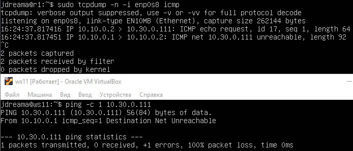

##### Сохранить дампы образов виртуальных машин

#### Part 6. Динамическая настройка IP с помощью **DHCP**

`-` Следующим нашим шагом будет более подробное знакомство со службой **DHCP**, которую ты уже знаешь.

*В данном задании используются виртуальные машины из Части 5*

##### Для r2 настроить в файле */etc/dhcp/dhcpd.conf* конфигурацию службы **DHCP**:

##### 1) указать адрес маршрутизатора по-умолчанию, DNS-сервер и адрес внутренней сети. Пример файла для r2:

```shell
subnet 10.100.0.0 netmask 255.255.0.0 {}

subnet 10.20.0.0 netmask 255.255.255.192

{
    range 10.20.0.2 10.20.0.50;
    option routers 10.20.0.1;
    option domain-name-servers 10.20.0.1;
}
```

##### 2) в файле *resolv.conf* прописать `nameserver 8.8.8.8.`

Установка недостающих пакетов

`sudo apt install isc-dhcp-server`

`sudo apt install resolvconf`

Проверка и редактирование

`sudo systemctl enable isc-dhcp-server`

`sudo mcedit /etc/dhcp/dhcpd.conf`

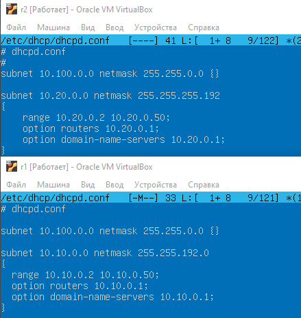

##### Указать MAC адрес у ws11, для этого в *etc/netplan/00-installer-config.yaml* надо добавить строки: `macaddress: 10:10:10:10:10:BA`, `dhcp4: true`

Ректируем netplan'ы на ws11 и ws21

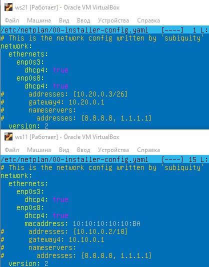

##### Перезагрузить службу **DHCP** командой `systemctl restart isc-dhcp-server`. Машину ws21 перезагрузить при помощи `reboot` и через `ip a` показать, что она получила адрес. Также пропинговать ws22 с ws21.

`sudo systemctl restart isc-dhcp-server`

`sudo systemctl status isc-dhcp-server`


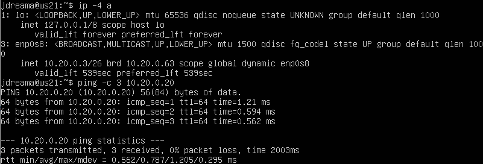

В r1 и r2 пришлость поменять hostname в файле /etc/hosts на корректные, что бы запустился resolv.

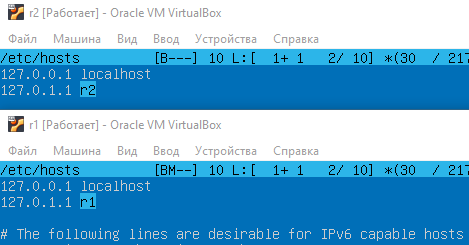

`sudo systemctl start resolvconf`

`sudo systemctl enable resolvconf`

`sudo mcedit /etc/resolv.conf`

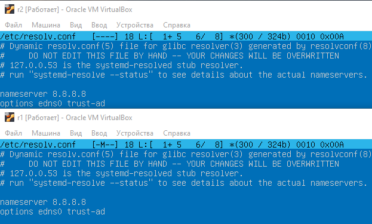

`sudo systemctl restart resolvconf`

`sudo systemctl status resolvconf`

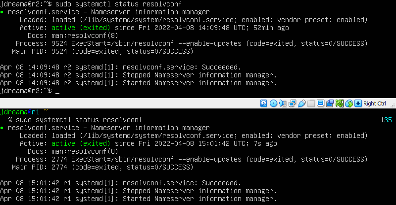

`sudo mcedit /etc/hosts`


##### Для r1 настроить аналогично r2, но сделать выдачу адресов с жесткой привязкой к MAC-адресу (ws11). Провести аналогичные тесты

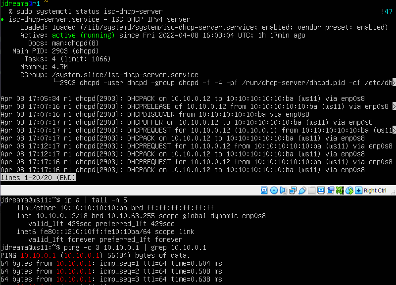

##### Запросить с ws21 обновление ip адреса

- В отчёте поместить скрины ip до и после обновления.

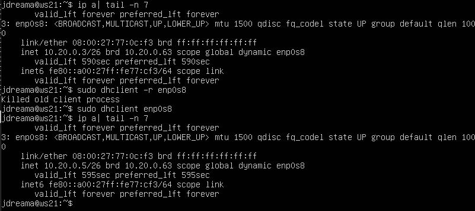

- В отчёте описать, какими опциями **DHCP** сервера пользовались в данном пункте.

`sudo dhclint -r enp0X` удалить IP

`sudo dhclint  enp0X` назначить IP

`*X` - номер интерфеса согласно netplan

##### Сохранить дампы образов виртуальных машин

## Part 7. **NAT**

*В данном задании используются виртуальные машины из Части 5*

##### В файле */etc/apache2/ports.conf* на ws22 и r2 изменить строку `Listen 80` на `Listen 0.0.0.0:80`, то есть сделать сервер Apache2 общедоступным

`sudo apt inastall apache2 -y`

`sudo mcedit /etc/apache2/ports.conf`

- В отчёт поместить скрин с содержанием изменённого файла.

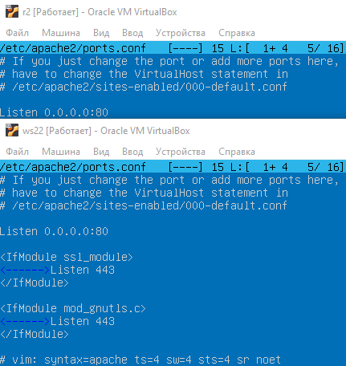

##### Запустить веб-сервер Apache командой `service apache2 start` на ws22 и r1

- В отчёт поместить скрины с вызовом и выводом использованной команды.

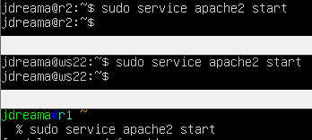 Добавить в фаервол, созданный по аналогии с фаерволом из Части 4, на r2 следующие правила:

##### 1) Удаление правил в таблице filter - `iptables -F`

##### 2) Удаление правил в таблице "NAT" - `iptables -F -t nat`

##### 3) Отбрасывать все маршрутизируемые пакеты - `iptables --policy FORWARD DROP`

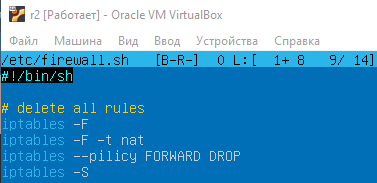

##### Запускать файл также, как в Части 4

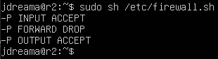

##### Проверить соединение между ws22 и r1 командой `ping`

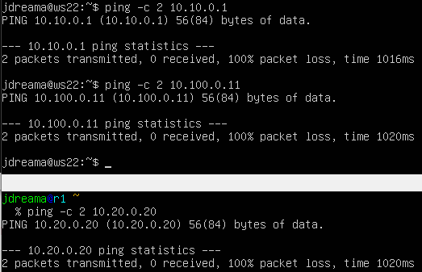

*При запуске файла с этими правилами, ws22 не должна "пинговаться" с r1*

##### Добавить в файл ещё одно правило:

##### 4) Разрешить маршрутизацию всех пакетов протокола **ICMP**


##### Запускать файл также, как в Части 4

##### Проверить соединение между ws22 и r1 командой `ping`

*При запуске файла с этими правилами, ws22 должна "пинговаться" с r1*

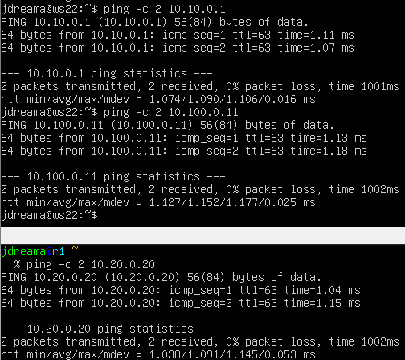

##### Добавить в файл ещё два правила:

##### 5) Включить **SNAT**, а именно маскирование всех локальных ip из локальной сети, находящейся за r2 (по обозначениям из Части 5 - сеть 10.20.0.0)

*Совет: стоит подумать о маршрутизации внутренних пакетов, а также внешних пакетов с установленным соединением*

##### 6) Включить **DNAT** на 8080 порт машины r2 и добавить к веб-серверу Apache, запущенному на ws22, доступ извне сети

*Совет: стоит учесть, что при попытке подключения возникнет новое tcp-соединение, предназначенное ws22 и 80 порту*

- В отчёт поместить скрин с содержанием изменённого файла.

##### Запускать файл также, как в Части 4

*Перед тестированием рекомендуется отключить сетевой интерфейс **NAT** (его наличие можно проверить командой `ip a`) в VirtualBox, если он включен*

- **SNAT** - *Source Network Address Translation* - изменение адреса и порта источника пакета, доступен в цепочке POSTROUTING
- **DNAT** - *Destination Network Address Translation* - изменение адреса и порта назначения пакета, доступен в цепочках PREROUTING и OUTPUT

##### Проверить соединение по TCP для **SNAT**, для этого с ws22 подключиться к серверу Apache на r1 командой:

`telnet [адрес] [порт]`

##### Проверить соединение по TCP для **DNAT**, для этого с r1 подключиться к серверу Apache на ws22 командой `telnet` (обращаться по адресу r2 и порту 8080)

- В отчёт поместить скрины с вызовом и выводом использованных команд.

##### Сохранить дампы образов виртуальных машин

## Part 8. Дополнительно. Знакомство с **SSH Tunnels**

`-` Пожалуй, на этом у меня всё. Может у тебя появились ещё какие-то вопросы?

`-` Да, я хотел спросить ещё об одной вещи. На работе я краем уха услышал, что в моей компании есть некие проекты по обучению. Подробностей я не знаю, но очень хочется взглянуть... Вдруг будет полезно

`-` Действительно интересно, но как в этом помогу тебе я?

`-` Дело в том, что, чтобы добраться до этих проектов, нужно получить доступ к закрытой сети. Можешь посоветовать что-нибудь по этому поводу?

`-` Ну ты, конечно, даёшь... Не уверен на все сто, что это поможет, но могу рассказать тебе про **SSH Tunnels**.

**== Задание ==**

*В данном задании используются виртуальные машины из Части 5*

##### Запустить веб-сервер **Apache** на ws22 только на localhost (то есть не изменять файл */etc/apache2/ports.conf* или, если был изменен ранее, вернуть строку `Listen 80`)

##### Воспользоваться *Local TCP forwarding* с ws21 до ws22, чтобы получить доступ к веб-серверу на ws22 с ws21

##### Воспользоваться *Remote TCP forwarding* c ws11 до ws22, чтобы получить доступ к веб-серверу на ws22 с ws11

##### Для проверки, сработало ли подключение в обоих предыдущих пунктах, перейдите во второй терминал (например, клавишами Alt + F2) и выполните команду:

`telnet 127.0.0.1 [локальный порт]`

- В отчёте описать команды, необходимые для выполнения этих четырёх пунктов, а также приложить скриншоты с их вызовом и выводом.

##### Сохранить дампы образов виртуальных машин
